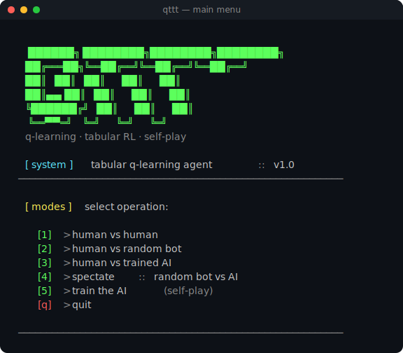
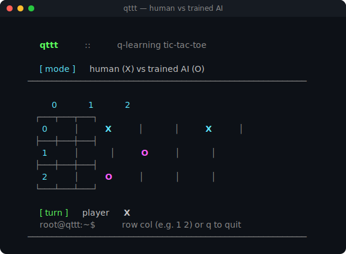
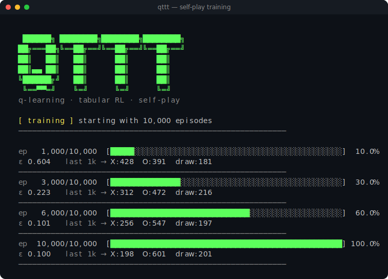

# qttt — Q-Learning Tic-Tac-Toe

A tabular Q-learning agent that learns Tic-Tac-Toe by playing millions of
games against itself. No neural networks, no dependencies — just classical
reinforcement learning you can read end-to-end in about 300 lines of Python.

---

## Play

### In your browser
**[Open the web version →](https://heltonmaia.github.io/qttt/web/)**

Powered by [Pyodide](https://pyodide.org/) — the same Python code runs
inside your browser. No backend, no installation.

### In your terminal

```bash
git clone https://github.com/heltonmaia/qttt.git
cd qttt
python main.py
```

Requires Python 3.6+. No dependencies.

---

## Modes

| # | Mode                                               |
|---|----------------------------------------------------|
| 1 | human vs human                                     |
| 2 | human vs random bot                                |
| 3 | human vs trained AI                                |
| 4 | spectate: random bot vs trained AI                 |
| 5 | train the AI (self-play, ~10s) *(terminal only)*   |

A pre-trained model ships in `models/qlearning_model.pkl`, so you can jump
straight into modes 3 and 4 without training first. The web version uses
this same pre-trained model.

---

## Screenshots







---

## Want to understand how it works?

See **[LEARN.md](LEARN.md)** — a short, self-contained lecture on
reinforcement learning built around this codebase. Covers states, actions,
rewards, Q-learning, the Bellman equation, ε-greedy, self-play, and where
to go after tabular methods.

---

## License

MIT — see `LICENSE`.
